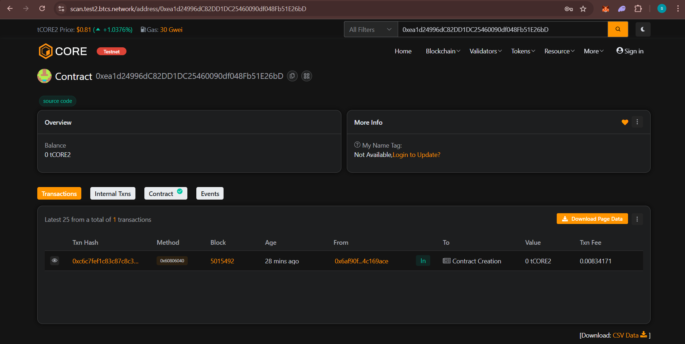

# 🔢 Simple Counter Smart Contract

_Contract verified on Block Explorer_

**Contract Address:** `[0xea1d24996dC82DD1DC25460090df048Fb51E26bD]`

---

## 📖 About

The Simple Counter Smart Contract is a minimalist yet fully functional smart contract that demonstrates basic blockchain state management. Built with Solidity 0.8+, it provides a secure and gas-efficient way to maintain a counter value on the blockchain.

## 🎯 Contract Overview

This contract implements a simple counter with the following capabilities:

### Core Functions

- **Increment Counter**: Increase the counter value by 1
- **Decrement Counter**: Decrease the counter value by 1 (with underflow protection)
- **View Counter**: Read the current counter value
- **Reset Counter**: Set the counter back to zero
- **Set Counter**: Set the counter to any specific value

### Security Features

- **Underflow Protection**: Prevents counter from going below zero
- **Event Emission**: All state changes emit events for transparency
- **Gas Optimized**: Efficient storage and function design
- **Solidity 0.8+**: Built-in overflow/underflow protection

## 🔧 Contract Details

| Property             | Value                                          |
| -------------------- | ---------------------------------------------- |
| **Contract Name**    | `SimpleCounter`                                |
| **Solidity Version** | `^0.8.28`                                      |
| **License**          | MIT                                            |
| **Contract Address** | `[0xea1d24996dC82DD1DC25460090df048Fb51E26bD]` |

**Built with ❤️ using Solidity**

[Contract Source Code]([PASTE_GITHUB_LINK]) • [Block Explorer]([PASTE_EXPLORER_LINK_HERE]) • [Documentation](./docs)

